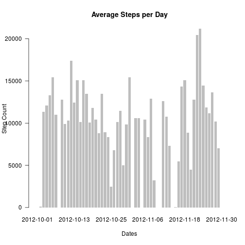
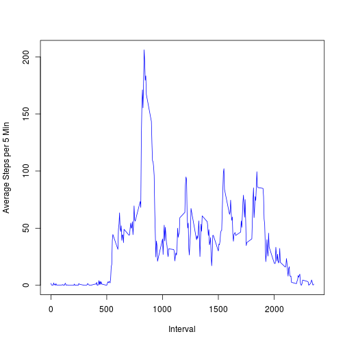
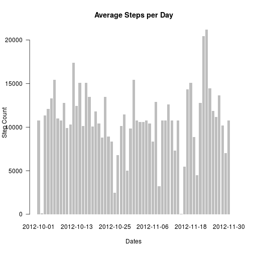
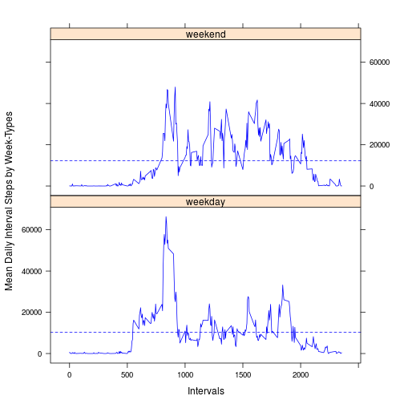

# Reproducible Research: Peer Assessment 1

*This assignment covers imputation of missing values, coupled with applying functions to factors; plotting results for further analyis. The R Markdown document included in this repository can be run with the R Package knitr, to fully replicate the results given. Additionally, the lattice and plyr packages were used for manipulating data and plotting stacked panel plots with respective grouped means.*

## 1.Loading and preprocessing the data


```r
#Unzips file included in Repo
unzip("activity.zip")

#Reads .csv generated by unzip as Data Table
dataRaw <- read.table("activity.csv", sep = "," , header = TRUE)
dataRaw$date <- as.Date(dataRaw$date)

summary(dataRaw)
```

```
##      steps            date               interval   
##  Min.   :  0.0   Min.   :2012-10-01   Min.   :   0  
##  1st Qu.:  0.0   1st Qu.:2012-10-16   1st Qu.: 589  
##  Median :  0.0   Median :2012-10-31   Median :1178  
##  Mean   : 37.4   Mean   :2012-10-31   Mean   :1178  
##  3rd Qu.: 12.0   3rd Qu.:2012-11-15   3rd Qu.:1766  
##  Max.   :806.0   Max.   :2012-11-30   Max.   :2355  
##  NA's   :2304
```

```r
str(dataRaw)
```

```
## 'data.frame':	17568 obs. of  3 variables:
##  $ steps   : int  NA NA NA NA NA NA NA NA NA NA ...
##  $ date    : Date, format: "2012-10-01" "2012-10-01" ...
##  $ interval: int  0 5 10 15 20 25 30 35 40 45 ...
```
*Note*: Includes NA's

## 2. What is mean total number of steps taken per day?

### Total Daily Steps visualized with NA's included.

```r
#Raw Data grouped steps by date
groupedData <- aggregate(dataRaw, by = list(dataRaw$date), FUN = mean, na.rm = FALSE)
groupedData$steps <- groupedData$steps * 12 * 24 #5 min Interval to daily
head(groupedData)
```

```
##      Group.1 steps       date interval
## 1 2012-10-01    NA 2012-10-01     1178
## 2 2012-10-02   126 2012-10-02     1178
## 3 2012-10-03 11352 2012-10-03     1178
## 4 2012-10-04 12116 2012-10-04     1178
## 5 2012-10-05 13294 2012-10-05     1178
## 6 2012-10-06 15420 2012-10-06     1178
```

```r
hist(groupedData$steps, main = "Average Daily Steps, from 61 Unique Days", xlab = "Daily Steps (based on Average 5 Minute Interval")
```

 

### *NOTE: Missing Days still need to be dealt with!

```r
#Time series barplot (i.e., histogram) showing the frequecy of steps grouped by date.
barplot(groupedData$steps, names.arg = groupedData$Group.1, main= "Average Steps per Day", xlab = "Dates", ylab="Step Count", las = 1, border = NA) 
```

 

### Calculates the mean and median steps per day, without imputing missing values.

```r
dataRawS <- summary(groupedData$steps)
dataRawS["Mean"] #Returns mean from summary object
```

```
##  Mean 
## 10800
```

```r
dataRawS["Median"] #Returns median from summary object
```

```
## Median 
##  10800
```


## 3. What is the average daily activity pattern?


### Average steps over 5 min interval -- across full period.


```r
#Interval Data
intervalData <- aggregate(dataRaw, by = list(dataRaw$interval), FUN = mean, na.rm = TRUE)

#Plot by interval (x-axis) and average steps
plot(steps ~ interval, data = intervalData, col = "blue", type = "l", xlab = "Interval", ylab = "Average Steps per 5 Min")
```

 


### Calculates 5-minute interval with max number of steps -- over full period.

```r
maxSteps <- max(intervalData$steps)
maxSteps # Max steps per average interval
```

```
## [1] 206.2
```

```r
intervalByMax <- intervalData$interval[intervalData$steps == maxSteps]
intervalByMax # Exact 5 Min interval where avg max steps were recorded
```

```
## [1] 835
```


## 4. Imputing missing values

## Find NAs and replace with mean -- imputed values may introduce bias

### Total misssing values in original set    

```r
summary(dataRaw$steps)[7] #Total rows from raw data with NAs
```

```
## NA's 
## 2304
```
   
### Removes NAs per daily group, and replaces with the steps' daily means. 

```r
library(plyr)

dataImputed <- dataRaw

#Finds the mean step of each interval
meanSet <- ddply(dataImputed, "interval", summarize, means = mean(steps, na.rm=TRUE))


#Replaces NA's with mean of each interval
dataImputed$steps[is.na(dataImputed$steps)] <- meanSet$means[match(dataImputed$interval, meanSet$interval)][is.na(dataImputed$steps)]
```


### Histogram of the total number of daily steps

```r
#Imputed Data grouped steps by date
groupedImpData <- aggregate(dataImputed, by = list(dataImputed$date), FUN = mean, na.rm = FALSE)
groupedImpData$steps <- groupedImpData$steps*12*24

hist(groupedImpData$steps, main = "Average Daily Steps, Imputed and Grouped from 61 Unique Days", xlab = "Daily Steps (based on Average 5 Minute Intervals")
```

 

```r
#Reference time-series with imputed values included; note diff.
barplot(groupedImpData$steps, names.arg = groupedImpData$Group.1, main= "Average Steps per Day", xlab = "Dates", ylab="Step Count", las = 1, border = NA) 
```

 

### Mean and Median daily steps -- from imputed data
Note: differs slightly from previous histogram; testing for significance may be appropriate in later study.

```r
mean(groupedImpData$steps) #Average Daily Steps, Imputed by Daily Means   , na.rm = TRUE
```

```
## [1] 10766
```

```r
median(groupedImpData$steps) #Median Daily Steps, Imputed by Daily Means
```

```
## [1] 10766
```


## 5. Are there differences in activity patterns between weekdays and weekends?


### Adds column to imputed Data, with related days of week and sets Week Types / Days


```r
library(lattice)

dataImputed$weekDay <- weekdays(dataImputed$date) 
dataImputed$weekDay <- as.factor(dataImputed$weekDay)
dataImputed$weekDay <- as.factor(dataImputed$weekDay)

dataImputed$weekType[!dataImputed$weekDay %in% c("Saturday", "Sunday")] <- "weekday"
dataImputed$weekType[dataImputed$weekDay %in% c("Saturday", "Sunday")] <- "weekend"
dataImputed$weekType <- as.factor(dataImputed$weekType)
dataImputed$steps <- dataImputed$steps*12*24 #Converts to daily from 5-min steps
```

### Panel plot time series separated by Week Type (i.e., "weekend", "weekday")

```r
#Imputed Data grouped steps by date
meanSetWeekType <- ddply(dataImputed, c("interval", "weekType"), summarize, means = mean(steps, na.rm=TRUE))
head(meanSetWeekType)
```

```
##   interval weekType   means
## 1        0  weekday 648.332
## 2        0  weekend  61.811
## 3        5  weekday 128.242
## 4        5  weekend  12.226
## 5       10  weekday  49.872
## 6       10  weekend   4.755
```

```r
#Panel plots separated by weekend / weekday -- showing means
xyplot(means ~ interval | weekType, data = meanSetWeekType,  layout = c(1,2), type = "l", ylab = "Mean Daily Interval Steps by Week-Types", xlab = "Intervals", col = "blue", 
        panel = function(x, y, ...) { panel.xyplot(x, y, ...) 
        panel.abline(mean(y), col ='blue', lty = 2) 
        })
```

 

Summary: There appears to be a difference in means between daily steps on weekends versus weekdays. Weekend daily steps appears larger. A test of differences may be appropriate, after concluding stationarity. An extra column for weekdays is included in the imputed set for further analyses.
    
Access html view [here](http://htmlpreview.github.io/?https://github.com/ZeccaLehn/RepData_PeerAssessment1/blob/master/PA1_template.html).


